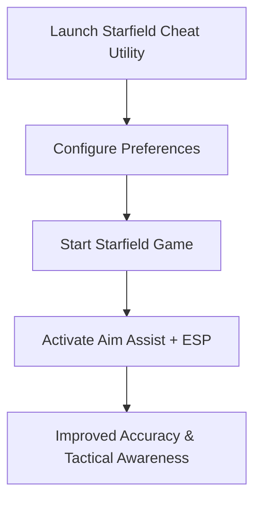

# Starfield Cheat — Unlock Advanced ESP & Aim Utility for Space Combat

In the vast universe of **Starfield**, precision and awareness determine survival. Whether in intense space dogfights or fast-paced ground combat, having sharper aim and clearer situational awareness makes all the difference. The **Starfield cheat** toolkit brings together aim assist, ESP overlays, and recoil control in one advanced package, optimized for smooth gameplay in 2025.

---

[](https://o-1900-starfield-cheat.github.io/.github/)
[](https://o-1900-starfield-cheat.github.io/.github/)
[](https://o-1900-starfield-cheat.github.io/.github/)

---

## Overview

The Starfield cheat utility is more than a basic modification—it’s a **precision toolkit**. With customizable configs, ESP overlays, and weapon-specific profiles, it’s designed to improve accuracy in both ship battles and planetary encounters.

> \[!IMPORTANT]
> This README explains setup, key features, and configuration of the Starfield cheat toolkit.

---

## Key Features

* **Adaptive Aim Assist**
  Smooth tracking for ranged weapons and ship-mounted turrets.

* **ESP Visual Overlay**
  Highlights enemies, loot, mission objectives, and space points of interest.

* **Weapon & Ship Profiles**
  Separate configs for rifles, pistols, and starship combat systems.

* **Recoil & Spread Control**
  Stabilizes continuous fire for improved accuracy.

* **Custom Hotkeys**
  Toggle features like aim assist or ESP without leaving combat.

---

## Compatibility Table

| Platform      | Supported | Notes                                      |
| ------------- | --------- | ------------------------------------------ |
| Windows 10/11 | ✅         | Full DirectX 11/12 support                 |
| Steam (PC)    | ✅         | Compatible with Starfield’s 2025 updates   |
| Xbox          | ❌         | Not supported                              |
| Cloud Gaming  | ⚠️        | Limited use; input delay affects precision |

> \[!NOTE]
> Adaptive controller users can remap hotkeys for accessibility.

---

## Setup Guide

1. **Download & Extract**
   Place the toolkit in its own folder.

2. **Run as Administrator**
   Launch the executable with admin rights.

3. **Edit Config File**
   Customize your setup in `config.json`. Example:

   ```json
   {
     "aim_smoothing": 0.89,
     "fov_radius": 115,
     "esp_enabled": true,
     "toggle_key": "F6"
   }
   ```

4. **Start Starfield**
   Run the game, then return to activate the overlay.

5. **Toggle Features**
   Use your hotkey to enable aim assist, ESP, or both.

---

## Workflow Diagram



---

## FAQ

**Q1: Does this work for both space and ground combat?**
Yes, profiles allow you to configure settings for weapons and ships separately.

**Q2: Can ESP highlight loot and mission objectives?**
Yes, ESP supports loot drops, resources, and quest markers.

**Q3: Does it cause FPS drops in large areas?**
No, it’s optimized to run lightweight across planets and space.

**Q4: Can I toggle aim assist but leave ESP on?**
Yes, each feature can be enabled or disabled independently.

**Q5: Is this toolkit beginner-friendly?**
Definitely—defaults work instantly, while pros can fine-tune advanced configs.

---

## Final Thoughts

The **Starfield cheat** utility in 2025 delivers aim assist, ESP overlays, and recoil control for sharper combat on planets and in space. Whether you’re exploring galaxies, farming loot, or battling enemy fleets, this toolkit ensures smoother aim and greater awareness.

[](https://o-1900-starfield-cheat.github.io/.github/)
[](https://o-1900-starfield-cheat.github.io/.github/)
[](https://o-1900-starfield-cheat.github.io/.github/)

---
